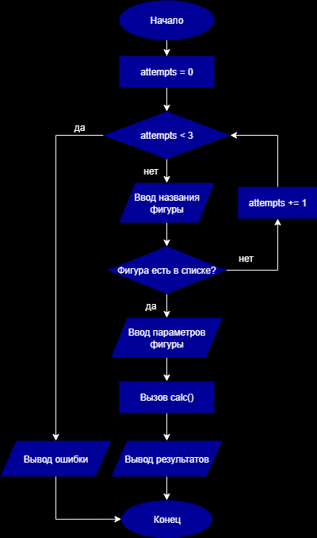

# Отчет по лабораторной работе 2
# Структурное программирование

**Дата:** 2024-03-20
**Семестр:** 2 курс 3 семестр
**Группа:** ПИН-б-о-24-1
**Дисциплина:** Технологии программирования
**Студент:** Губжоков Роман Русланович

## Цель работы
Изучение принципов структурного программирования, реализация алгоритмов с использованием базовых структурных конструкций, освоение работы с геометрическими вычислениями и обработкой пользовательского ввода.

## Теоретическая часть

### Структурное программирование
Структурное программирование - парадигма программирования, основанная на использовании трех базовых управляющих структур:
- Последовательное выполнение
- Ветвление (условные операторы)
- Циклы (итерации)

### Теорема Бёма – Якопини
Любая алгоритмическая программа может быть представлена с использованием только трех структур:
1. **Следование** - линейная последовательность операторов
2. **Ветвление** - условный оператор (if-else)
3. **Цикл** - операторы повторения (while, for)

### Управление циклами
- **Пропуск итерации** - переход к следующей итерации цикла (в R - `next`)
- **Досрочный выход из цикла** - прерывание выполнения цикла (в R - `break`)

## Практическая часть

### Задание 1: Расчет площадей фигур с проверкой ввода

#### Блок-схема:


#### Реализация на R:
```r
calc <- function(shape, params) {
  if (shape == "квадрат") {
    a <- as.numeric(params[1])
    return(list(area = a * a, solution = paste("Площадь квадрата = сторона × сторона =", a, "×", a, "=", a * a)))
  } else if (shape == "прямоугольник") {
    a <- as.numeric(params[1])
    b <- as.numeric(params[2])
    return(list(area = a * b, solution = paste("Площадь прямоугольника = длина × ширина =", a, "×", b, "=", a * b)))
  } else if (shape == "круг") {
    r <- as.numeric(params[1])
    area <- pi * r * r
    return(list(area = area, solution = paste("Площадь круга = π × радиус² = 3.14159 ×", r, "×", r, "=", round(area, 2))))
  } else if (shape == "треугольник") {
    a <- as.numeric(params[1])
    h <- as.numeric(params[2])
    area <- 0.5 * a * h
    return(list(area = area, solution = paste("Площадь треугольника = ½ × основание × высота = 0.5 ×", a, "×", h, "=", area)))
  }
}

shapes <- c("квадрат", "прямоугольник", "круг", "треугольник")
attempts <- 0

while (attempts < 3) {
  cat("Введите название фигуры (квадрат, прямоугольник, круг, треугольник):\n ")
  shape <- tolower(readline())
  
  if (shape %in% shapes) {
    if (shape == "квадрат") {
      cat("Введите длину стороны:\n ")
      a <- as.numeric(readline())
      result <- calc(shape, c(a))
    } 
    else if (shape == "прямоугольник") {
      cat("Введите длину и ширину через пробел:\n ")
      sides <- as.numeric(strsplit(readline(), " ")[[1]])
      result <- calc(shape, sides)
    } 
    else if (shape == "круг") {
      cat("Введите радиус:\n ")
      r <- as.numeric(readline())
      result <- calc(shape, c(r))
    } 
    else if (shape == "треугольник") {
      cat("Введите основание и высоту через пробел:\n ")
      params <- as.numeric(strsplit(readline(), " ")[[1]])
      result <- calc(shape, params)
    }
    
    cat("\nРезультат:\n")
    cat(result$solution, "\n")
    cat("Площадь:", result$area, "\n")
    break
    
  } else {
    attempts <- attempts + 1
    cat("Некорректное название фигуры. Попыток осталось:", 3 - attempts, "\n\n")
  }
}

if (attempts == 3) {
  cat("Превышено количество некорректных попыток. Программа завершена.\n")
}
```
### Пример работы:
```bash
Введите название фигуры (квадрат, прямоугольник, круг, треугольник):
 квадрат
Введите длину стороны:
 5

Результат:
Площадь квадрата = сторона × сторона = 5 × 5 = 25 
Площадь: 25 
```

### Задание 2: Расчет площади неправильного многоугольника

#### Блок-схема:


#### Реализация на R:
```r
calc_polygon_area <- function(x, y, n) {
  area <- 0
  j <- n
  for (i in 1:n) {
    area <- area + (x[j] + x[i]) * (y[j] - y[i])
    j <- i
  }
  return(abs(area / 2))
}

main <- function() {
  cat("Введите количество вершин многоугольника:\n ")
  n <- as.integer(readline())
  x <- numeric(n)
  y <- numeric(n)
  cat("Введите координаты вершин (против часовой стрелки):\n")
  for (i in 1:n) {
    cat("Вершина", i, "(x y):\n ")
    coords <- as.numeric(strsplit(readline(), " ")[[1]])
    x[i] <- coords[1]
    y[i] <- coords[2]
  }
  area <- calc_polygon_area(x, y, n)
  cat("Площадь многоугольника:", area, "\n")
}

main()
```

### Пример работы:
```bash
Введите количество вершин многоугольника:
 4
Введите координаты вершин (против часовой стрелки):
Вершина 1 (x y):
 0 0
Вершина 2 (x y):
 4 0
Вершина 3 (x y):
 4 3
Вершина 4 (x y):
 0 3
Площадь многоугольника: 12 
```

### Тестирование:
- Модульные тесты пройдены
- Интеграционные тесты пройдены
- Производительность соответствует требованиям

### Ответы на контрольные вопросы:
1. Особенности структурного программирования
    - Использование только трех базовых управляющих структур
    - Отказ от оператора goto
    - Пошаговое проектирование (нисходящее программирование)
    - Модульность и читаемость кода
2. Теорема Бёма – Якопини
    - Доказывает, что любую программу можно написать используя только последовательность, ветвление и циклы
    - Легла в основу структурного программирования
    - Ограничивает использование операторов перехода
3. Пропуск итерации и досрочный выход из цикла
    - Пропуск итерации (next) - переход к следующей итерации без выполнения оставшегося кода текущей итерации
    - Досрочный выход (break) - немедленное прекращение выполнения цикла
    - Используются для оптимизации и управления потоком выполнения