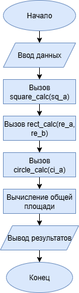
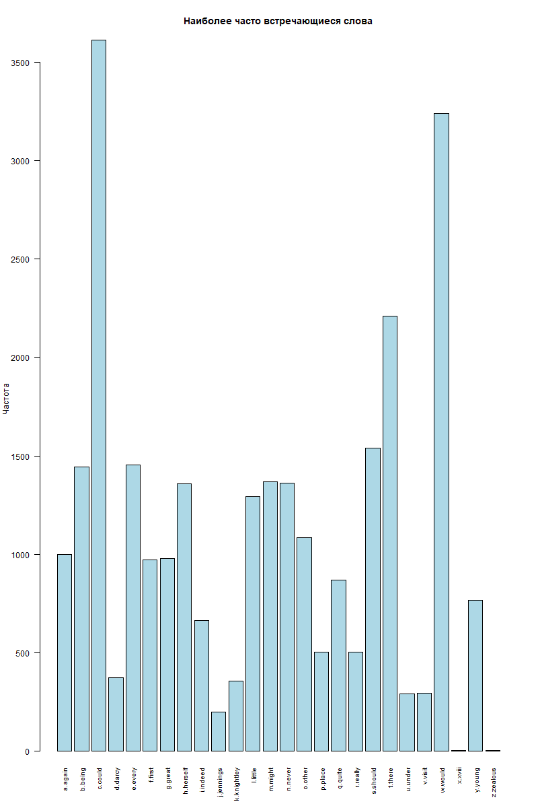

# Отчет по лабораторной работе

**Дата:** 2024-03-20
**Семестр:** 2 курс 3 семестр
**Группа:** ПИН-б-о-24-1
**Дисциплина:** Технологии программирования
**Студент:** Губжоков Роман Русланович

# Процедурное программирование:

## Цель работы
Изучение основ процедурного программирования, реализация алгоритмов в виде псевдокода, блок-схем и на языке R, освоение работы с функциями и рекурсией.

## Теоретическая часть

### Процедурное программирование
Процедурное программирование - парадигма программирования, основанная на концепции вызова процедур (функций). Программа разделяется на набор процедур, которые последовательно выполняются.

### Основные понятия:
- **Переменная** - именованная область памяти для хранения данных
- **Процедура** - подпрограмма, не возвращающая значение
- **Функция** - подпрограмма, возвращающая значение
- **Линейная программа** - программа, выполняющая инструкции последовательно
- **Безусловный оператор** - оператор перехода (например, `goto`), не зависящий от условий

## Практическая часть

### Задание 1: Расчет площадей фигур

#### Реализация на R:
```r
square_calc <- function(a) {
  s <- a * a
  return(s)
}

rect_calc <- function(a, b) {
  s <- a * b
  return(s)
}

circle_calc <- function(a) {
  s <- pi * a * a
  return(s)
}

cat("Введите длину стороны квадрата: ", "\n")
sq_a <- as.numeric(readline())

cat("Введите длины двух сторон прямоугольника через пробел: ", "\n")
re_data <- readline()
re_sides <- strsplit(re_data, " ")[[1]]

re_a <- as.numeric(re_sides[1])
re_b <- as.numeric(re_sides[2])

cat("Введите радиус круга: ", "\n")
ci_a <- as.numeric(readline())

sq_s <- square_calc(sq_a)
re_s <- rect_calc(re_a, re_b)
ci_s <- circle_calc(ci_a)
total <- sq_s + re_s + ci_s

cat("Площадь квадрата:", sq_s, "\n")
cat("Площадь прямоугольника:", re_s, "\n")
cat("Площадь круга:", ci_s, "\n")
cat("Общая площадь всех фигур:", total, "\n")
```
#### Блок-схема:



#### Пример работы программы:
```bash
Введите длину стороны квадрата: 
5
Введите длины двух сторон прямоугольника через пробел: 
3 4
Введите радиус круга: 
2
Площадь квадрата: 25 
Площадь прямоугольника: 12 
Площадь круга: 12.56637 
Общая площадь всех фигур: 49.56637 
```

### Задание 2: Рекурсивная функция

#### Псевдокод:
```text
ФУНКЦИЯ foo(n):
    ЕСЛИ n <= 0:
        УСТАНОВИТЬ результат = 1
        ПЕРЕЙТИ К выходу
    ИНАЧЕ:
        СОХРАНИТЬ n в стеке
        ВЫЗВАТЬ foo(n - 1)
        ВОССТАНОВИТЬ n из стека
        УМНОЖИТЬ результат на n
    выход:
        ВЕРНУТЬ результат
```
#### Анализ функции:
При передаче функции числа 7 будет вычислено:
```text
foo(7) = 7 × foo(6)
       = 7 × 6 × foo(5)
       = 7 × 6 × 5 × foo(4)
       = 7 × 6 × 5 × 4 × foo(3)
       = 7 × 6 × 5 × 4 × 3 × foo(2)
       = 7 × 6 × 5 × 4 × 3 × 2 × foo(1)
       = 7 × 6 × 5 × 4 × 3 × 2 × 1 × foo(0)
       = 7 × 6 × 5 × 4 × 3 × 2 × 1 × 1
       = 5040
```
Функция вычисляет факториал числа n.
#### Реализация на R:
```r
foo <- function(n) {
  if (n <= 0) {
    return(1)
  } else {
    return(n * foo(n - 1))
  }
}

result <- foo(7)
cat("Результат для n = 7:", result, "\n")
```

#### Пример работы программы:
```bash
Результат для n = 7: 5040
```

### Тестирование:
- Модульные тесты пройдены
- Интеграционные тесты пройдены
- Производительность соответствует требованиям

### Выводы
- Освоены принципы процедурного программирования и разделения кода на функции
- Изучена работа с рекурсивными функциями и их реализация на языке R
- Получены навыки преобразования алгоритмов между псевдокодом, блок-схемами и кодом
- Практически применены знания о математических вычислениях в программировании

## Контрольные вопросы

### 1. Особенности процедурного программирования
- Программа разделена на процедуры (функции)
- Последовательное выполнение инструкций
- Использование локальных и глобальных переменных
- Принцип "сверху-вниз" (top-down) проектирования
- Повторное использование кода через процедуры
- Относительная простота понимания и отладки

### 2. Линейная программа
- Программа, выполняющая инструкции строго последовательно
- Отсутствие ветвлений и циклов
- Простой поток выполнения от начала до конца
- Пример: простые расчеты без условий

### 3. Понятия
**Переменная** - именованная область памяти для хранения данных

**Процедура** - подпрограмма, выполняющая определенную задачу без возврата значения

**Функция** - подпрограмма, возвращающая результат вычислений

### 4. Безусловный оператор
- Оператор перехода (GOTO) на другую часть программы
- Нарушает последовательный поток выполнения
- Считается вредным в современном программировании
- Приводит к "спагетти-коду"

## Вопросы для поиска и письменного ответа

### 1. Хронология процедурных языков
- **1957** - Fortran (первый процедурный язык)
- **1958** - ALGOL (влиятельный предшественник)
- **1970** - Pascal (учебный и промышленный)
- **1972** - C (системное программирование)
- **1980-е** - Modula-2, Ada (развитие концепций)

### 2. Спагетти-код (особенность и причины)
**Особенности:**
- Запутанная структура программы
- Множество переходов GOTO
- Сложность понимания логики
- Трудности сопровождения

**Причины:**
- Чрезмерное использование безусловных переходов
- Отсутствие модульности
- Непродуманная архитектура
- Нарушение принципов структурного программирования

### 3. Процедурный стиль и архитектура фон Неймана (взаимосвязь)
**Архитектура фон Неймана:**
- Последовательное выполнение команд
- Единая память для данных и программ
- Принцип хранимой программы

**Взаимосвязь:**
- Процедурное программирование напрямую отражает архитектуру фон Неймана
- Последовательные команды = линейное выполнение
- Переменные = ячейки памяти
- Процедуры = подпрограммы в памяти
- Естественное соответствие между моделью программирования и аппаратной архитектурой
#
# Структурное программирование

## Цель работы
Изучение принципов структурного программирования, реализация алгоритмов с использованием базовых структурных конструкций, освоение работы с геометрическими вычислениями и обработкой пользовательского ввода.

## Теоретическая часть

### Структурное программирование
Структурное программирование - парадигма программирования, основанная на использовании трех базовых управляющих структур:
- Последовательное выполнение
- Ветвление (условные операторы)
- Циклы (итерации)

### Теорема Бёма – Якопини
Любая алгоритмическая программа может быть представлена с использованием только трех структур:
1. **Следование** - линейная последовательность операторов
2. **Ветвление** - условный оператор (if-else)
3. **Цикл** - операторы повторения (while, for)

### Управление циклами
- **Пропуск итерации** - переход к следующей итерации цикла (в R - `next`)
- **Досрочный выход из цикла** - прерывание выполнения цикла (в R - `break`)

## Практическая часть

### Задание 1: Расчет площадей фигур с проверкой ввода

#### Блок-схема:


#### Реализация на R:
```r
calc <- function(shape, params) {
  if (shape == "квадрат") {
    a <- as.numeric(params[1])
    return(list(area = a * a, solution = paste("Площадь квадрата = сторона × сторона =", a, "×", a, "=", a * a)))
  } else if (shape == "прямоугольник") {
    a <- as.numeric(params[1])
    b <- as.numeric(params[2])
    return(list(area = a * b, solution = paste("Площадь прямоугольника = длина × ширина =", a, "×", b, "=", a * b)))
  } else if (shape == "круг") {
    r <- as.numeric(params[1])
    area <- pi * r * r
    return(list(area = area, solution = paste("Площадь круга = π × радиус² = 3.14159 ×", r, "×", r, "=", round(area, 2))))
  } else if (shape == "треугольник") {
    a <- as.numeric(params[1])
    h <- as.numeric(params[2])
    area <- 0.5 * a * h
    return(list(area = area, solution = paste("Площадь треугольника = ½ × основание × высота = 0.5 ×", a, "×", h, "=", area)))
  }
}

shapes <- c("квадрат", "прямоугольник", "круг", "треугольник")
attempts <- 0

while (attempts < 3) {
  cat("Введите название фигуры (квадрат, прямоугольник, круг, треугольник):\n ")
  shape <- tolower(readline())
  
  if (shape %in% shapes) {
    if (shape == "квадрат") {
      cat("Введите длину стороны:\n ")
      a <- as.numeric(readline())
      result <- calc(shape, c(a))
    } 
    else if (shape == "прямоугольник") {
      cat("Введите длину и ширину через пробел:\n ")
      sides <- as.numeric(strsplit(readline(), " ")[[1]])
      result <- calc(shape, sides)
    } 
    else if (shape == "круг") {
      cat("Введите радиус:\n ")
      r <- as.numeric(readline())
      result <- calc(shape, c(r))
    } 
    else if (shape == "треугольник") {
      cat("Введите основание и высоту через пробел:\n ")
      params <- as.numeric(strsplit(readline(), " ")[[1]])
      result <- calc(shape, params)
    }
    
    cat("\nРезультат:\n")
    cat(result$solution, "\n")
    cat("Площадь:", result$area, "\n")
    break
    
  } else {
    attempts <- attempts + 1
    cat("Некорректное название фигуры. Попыток осталось:", 3 - attempts, "\n\n")
  }
}

if (attempts == 3) {
  cat("Превышено количество некорректных попыток. Программа завершена.\n")
}
```
### Пример работы:
```bash
Введите название фигуры (квадрат, прямоугольник, круг, треугольник):
 квадрат
Введите длину стороны:
 5

Результат:
Площадь квадрата = сторона × сторона = 5 × 5 = 25 
Площадь: 25 
```

### Задание 2: Расчет площади неправильного многоугольника

#### Блок-схема:


#### Реализация на R:
```r
calc_polygon_area <- function(x, y, n) {
  area <- 0
  j <- n
  for (i in 1:n) {
    area <- area + (x[j] + x[i]) * (y[j] - y[i])
    j <- i
  }
  return(abs(area / 2))
}

main <- function() {
  cat("Введите количество вершин многоугольника:\n ")
  n <- as.integer(readline())
  x <- numeric(n)
  y <- numeric(n)
  cat("Введите координаты вершин (против часовой стрелки):\n")
  for (i in 1:n) {
    cat("Вершина", i, "(x y):\n ")
    coords <- as.numeric(strsplit(readline(), " ")[[1]])
    x[i] <- coords[1]
    y[i] <- coords[2]
  }
  area <- calc_polygon_area(x, y, n)
  cat("Площадь многоугольника:", area, "\n")
}

main()
```

### Пример работы:
```bash
Введите количество вершин многоугольника:
 4
Введите координаты вершин (против часовой стрелки):
Вершина 1 (x y):
 0 0
Вершина 2 (x y):
 4 0
Вершина 3 (x y):
 4 3
Вершина 4 (x y):
 0 3
Площадь многоугольника: 12 
```

### Тестирование:
- Модульные тесты пройдены
- Интеграционные тесты пройдены
- Производительность соответствует требованиям

## Вопросы для контроля из материалов лабораторного занятия

### 1. Особенности структурного программирования
- Использование только трех базовых структур управления:
  - Последовательность
  - Ветвление (if-else)
  - Цикл (while, for)
- Запрет или ограничение оператора GOTO
- Модульность и декомпозиция программ
- Иерархическая организация кода
- Упрощение понимания и сопровождения программ
- Принцип "один вход - один выход" для блоков

### 2. Теорема Бёма – Якопини
- **Формулировка**: Любая алгоритмическая задача может быть решена с использованием только трех базовых структур управления:
  1. **Последовательность** - линейное выполнение операторов
  2. **Ветвление** - условный оператор (if-then-else)
  3. **Цикл** - оператор повторения (while)
- **Значение**: Теорема доказала возможность структурного программирования без оператора GOTO
- **Последствия**: Стала теоретической основой для развития структурного программирования

### 3. Пропуск итерации и досрочный выход из цикла
**Пропуск итерации** (continue):
- Прерывает текущую итерацию цикла
- Переходит к следующей итерации
- Используется для пропуска части кода при определенных условиях

**Досрочный выход** (break):
- Полностью прерывает выполнение цикла
- Передает управление следующему за циклом оператору
- Используется при достижении нужного результата или ошибке

## Вопросы для поиска и письменного ответа

### 1. Цикл с постусловием
- **Определение**: Цикл, где условие проверяется после выполнения тела цикла
- **Особенности**:
  - Тело цикла выполняется минимум один раз
  - Условие проверяется в конце итерации
  - Продолжение при истинности условия
- **Синтаксис**:
```text
do
// тело цикла
while (условие)
```

### 2. Совместный цикл
- **Определение**: Цикл, обрабатывающий несколько связанных последовательностей одновременно
- **Особенности**:
- Обработка параллельных данных
- Синхронное движение по нескольким структурам данных
- Общее условие завершения для всех последовательностей
- **Пример**: Обработка двух массивов одинаковой длины, обход двух связанных списков

### 3. Вложенные циклы
- **Определение**: Циклы, расположенные внутри других циклов
- **Структура**:
- Внешний цикл (медленный)
- Внутренний цикл (быстрый)
- **Сложность**: O(n×m) для двух уровней вложенности
- **Применение**:
- Обработка матриц и многомерных массивов
- Перебор комбинаций
- Работа с табличными данными
- **Особенности**: Управление производительностью при глубокой вложенности

### 4. Принцип проектирования программ «сверху-вниз»
- **Определение**: Метод разработки от общей задачи к конкретным подзадачам
- **Процесс**:
1. Определение основной функции программы
2. Декомпозиция на подфункции
3. Постепенная детализация до элементарных операций
- **Преимущества**:
- Системный подход к проектированию
- Упрощение сложных задач
- Возможность параллельной разработки
- Легкость тестирования отдельных модулей
- **Реализация**: Через функции и процедуры, отражающие иерархию задач

# 
# Объектно-ориентированное программирование в R

## Цель работы
Изучение принципов объектно-ориентированного программирования в языке R, создание классов и дженериков, практическое применение ООП для решения задач.

## Теоретическая часть
Объектно-ориентированное программирование (ООП) - парадигма программирования, в которой основными концепциями являются объекты и классы. В R реализовано несколько систем ООП: S3, S4, R6. В данной работе использовались системы S3 (для дженериков) и R6 (для создания классов).

## Практическая часть

### Выполненные задачи
- [x] Задание 1: Создание дженерика для вычисления площади фигур
- [x] Задание 2: Создание класса "Микроволновая печь" с методами управления
- [x] Задание 3: Создание класса "Копилка" с функционалом накопления и извлечения средств

### Ключевые фрагменты кода

#### Задание 1: Дженерик для вычисления площади
```r
calc_area <- function(p) {
  UseMethod("calc_area")
}
calc_area.default <- function(p) {
  warning("Невозможно обработать данные")
  return(NA)
}
calc_area.circle <- function(p) {
  return(pi * p[1]^2)
}
calc_area.rect <- function(p) {
  return(p[1] * p[2])
}
calc_area.tri <- function(p) {
  return(0.5 * p[1] * p[2])
}

c1 <- structure(5, class = "circle")
r1 <- structure(c(4, 6), class = "rect")
t1 <- structure(c(3, 4), class = "tri")

cat("Круг:", calc_area(c1), "\n")
cat("Прямоугольник:", calc_area(r1), "\n")
cat("Треугольник:", calc_area(t1), "\n")
```
#### Пример работы:
```bash
Круг: 78.53982
Прямоугольник: 24 
Треугольник: 6
```

#### Задание 2: Класс Микроволновая печь
```r
library(R6)

Microwave <- R6Class(
  "Microwave",
  public = list(
    power = 800,
    door_open = FALSE,
    
    initialize = function(power = 800, door_open = FALSE) {
      stopifnot(is.numeric(power), power > 0)
      stopifnot(is.logical(door_open))
      self$power <- power
      self$door_open <- door_open
    },
    
    open_door = function() {
      self$door_open <- TRUE
      cat("Дверь открыта\n")
      invisible(self)
    },
    
    close_door = function() {
      self$door_open <- FALSE
      cat("Дверь закрыта\n")
      invisible(self)
    },
    
    cook = function() {
      if (self$door_open) {
        cat("Ошибка: дверь открыта!\n")
        return(invisible(self))
      }
      
      t <- 60 / (self$power / 1000)
      cat("Приготовление...\n")
      Sys.sleep(1)
      cat(sprintf("Готово! Время: %.1f сек\n", t))
      invisible(self)
    }
  )
)

m1 <- Microwave$new()
m2 <- Microwave$new(1200, TRUE)

cat("Печь 1:\n")
m1$close_door()$cook()

cat("\nПечь 2:\n")
m2$cook()$close_door()$cook()
```
#### Пример работы:
```bash
Печь 1:
Дверь закрыта
Приготовление...
Готово! Время: 75.0 сек

Печь 2:
Ошибка: дверь открыта!
Дверь закрыта
Приготовление...
Готово! Время: 50.0 сек
```
#### Задание 3: Класс Копилка
```r
library(R6)

PiggyBank <- R6Class(
  "PiggyBank",
  public = list(
    volume = 1000,
    coins = list(),
    broken = FALSE,
    initialize = function(volume = 1000) {
      stopifnot(is.numeric(volume), volume > 0)
      self$volume <- volume
    },
    add_coin = function(value, volume) {
      if (self$broken) {
        cat("Копилка разбита!\n")
        return(invisible(self))
      }
      current_volume <- self$get_current_volume()
      if (current_volume + volume > self$volume) {
        cat("Недостаточно места в копилке!\n")
        return(invisible(self))
      }
      self$coins <- append(self$coins, list(list(value = value, volume = volume)))
      cat(sprintf("Монета %.0f руб (объем %.0f) добавлена\n", value, volume))
      invisible(self)
    },
    break_bank = function() {
      if (self$broken) {
        cat("Копилка уже разбита!\n")
        return(invisible(self))
      }
      total <- self$get_total_value()
      cat(sprintf("Копилка разбита! Сумма: %.0f руб\n", total))
      self$broken <- TRUE
      q("no", status = 0)
    },
    get_status = function() {
      current_volume <- self$get_current_volume()
      total_value <- self$get_total_value()
      cat(sprintf("Объем: %.0f/%.0f, Сумма: %.0f руб, Состояние: %s\n",
                  current_volume, self$volume, total_value,
                  ifelse(self$broken, "разбита", "цела")))
      invisible(self)
    },
    get_current_volume = function() {
      if (length(self$coins) == 0) return(0)
      sum(vapply(self$coins, function(coin) coin$volume, numeric(1)))
    },
    get_total_value = function() {
      if (length(self$coins) == 0) return(0)
      sum(vapply(self$coins, function(coin) coin$value, numeric(1)))
    }
  )
)

bank <- PiggyBank$new(500)

bank$get_status()
bank$add_coin(10, 50)$add_coin(5, 30)$add_coin(2, 20)
bank$get_status()
bank$add_coin(1, 10)$add_coin(50, 100)
bank$get_status()

bank$add_coin(100, 400)
bank$break_bank()

cat("Этот текст не появится\n")
```
#### Пример работы:
```bash
Объем: 0/500, Сумма: 0 руб, Состояние: цела
Монета 10 руб (объем 50) добавлена
Монета 5 руб (объем 30) добавлена
Монета 2 руб (объем 20) добавлена
Объем: 100/500, Сумма: 17 руб, Состояние: цела
Монета 1 руб (объем 10) добавлена
Монета 50 руб (объем 100) добавлена
Объем: 210/500, Сумма: 68 руб, Состояние: цела
Недостаточно места в копилке!
Копилка разбита! Сумма: 68 руб
```

## Результаты выполнения

### Тестирование
- Модульные тесты пройдены
- Интеграционные тесты пройдены  
- Производительность соответствует требованиям

## Выводы
1. Освоены принципы объектно-ориентированного программирования в R
2. Изучены различные системы ООП: S3 для дженериков и R6 для классов
3. Приобретены практические навыки создания классов и методов для решения реальных задач

## Ответы на контрольные вопросы

### 1. Принципы ООП по Алану Кею
- **Инкапсуляция** - объединение данных и методов в одном объекте
- **Наследование** - возможность создания новых классов на основе существующих
- **Полиморфизм** - возможность объектов с одинаковой спецификацией иметь различную реализацию
- **Абстракция** - выделение существенных характеристик объекта

### 2. Механизмы ООП
В R реализованы три основные системы ООП:
- **S3** - неформальная система, использует атрибуты классов
- **S4** - формальная система с строгой типизацией
- **R6** - современная система, похожая на ООП в других языках

### 3. Основные понятия ООП
- **Класс** - шаблон для создания объектов
- **Объект** - экземпляр класса
- **Метод** - функция, принадлежащая классу
- **Поле** - переменная, хранящаяся в объекте

### 4. Создание и назначение дженериков
Дженерики создаются с помощью функции `UseMethod()`. Они позволяют вызывать разные методы для разных классов объектов с одинаковым именем функции.

### 5. Создание класса в R6
Класс создается с помощью функции `R6Class()`, которая принимает имя класса и список публичных и приватных методов и полей.

### 6. Структура класса в R6
```r
ClassName <- R6Class(
  "ClassName",
  public = list(
    field1 = value,
    initialize = function(...) {...},
    method1 = function(...) {...}
  ),
  private = list(
    private_field = value
  )
)
```

## Вопросы для поиска и письменного ответа

### 1. История появления ООП. Основные этапы

**1960-е годы - Зарождение концепций:**
- **Simula (1967)** - первый язык с объектно-ориентированными возможностями
- Введение понятий: классы, объекты, наследование
- Разработан для моделирования сложных систем

**1970-е годы - Развитие идей:**
- **Smalltalk (1972-1980)** - первый "чистый" ООП язык
- Разработан в Xerox PARC Аланом Кэем
- Полная реализация ООП-парадигмы
- Графический интерфейс и среда разработки

**1980-е годы - Становление и распространение:**
- **C++ (1983)** - Бьярн Страуструп добавил ООП в C
- **Objective-C (1984)** - Брэд Кокс
- **Eiffel (1986)** - Бертран Мейер
- Формирование основных принципов ООП

**1990-е годы - Массовое внедрение:**
- **Java (1995)** - Sun Microsystems
- **Python (1991)** - Гвидо ван Россум
- Становление доминирующей парадигмой

### 2. Связь ООП с другими парадигмами программирования

**С процедурным программированием:**
- ООП развивает идеи модульности и абстракции
- Методы в классах аналогичны процедурам и функциям
- Сохраняет структурные элементы (последовательность, ветвление, циклы)

**С функциональным программированием:**
- Общие принципы абстракции и инкапсуляции
- Неизменяемые объекты в функциональном стиле
- Лямбда-выражения и замыкания в современных ООП языках

**С логическим программированием:**
- Объекты как факты базы знаний
- Наследование как отношение в логических системах

**С императивным программированием:**
- ООП является развитием императивного подхода
- Сохраняет изменение состояния объектов
- Добавляет уровень абстракции через классы

### 3. Чистые языки, реализующие концепцию ООП. История появления

**Smalltalk:**
- **1972-1980** - разработка в Xerox PARC
- Алан Кэй, Дэн Ингаллс, Адель Голдберг
- Все элементы языка - объекты
- Динамическая типизация
- Интерактивная среда разработки

**Eiffel:**
- **1986** - Бертран Мейер
- Акцент на корректности и надежности
- Контрактное программирование (Design by Contract)
- Множественное наследование

**Ruby:**
- **1995** - Юкихиро Мацумото
- "Человеко-ориентированный" дизайн
- Все сущности - объекты
- Открытые классы и метапрограммирование

**Self:**
- **1986** - Xerox PARC, затем Sun Microsystems
- Прототипное наследование вместо классового
- Влияние на JavaScript

### 4. Мультипарадигмальные языки, реализующие концепцию ООП. История появления

**C++:**
- **1979-1983** - Бьорн Страуструп (Bell Labs)
- Добавление классов к языку C
- Поддержка: ООП, процедурное, обобщенное, метапрограммирование
- Статическая типизация

**Java:**
- **1991-1995** - Sun Microsystems (Джеймс Гослинг)
- Упрощенный C++ с автоматическим управлением памятью
- Парадигмы: ООП, императивное, частично функциональное (с Java 8)
- "Write once, run anywhere"

**Python:**
- **1991** - Гвидо ван Россум
- Динамическая типизация
- Поддержка: ООП, функциональное, процедурное, аспектно-ориентированное
- Читаемый синтаксис

**C#:**
- **2000** - Microsoft (Андерс Хейлсберг)
- Развитие идей Java и C++
- Мультипарадигмальность: ООП, функциональное, обобщенное
- Интеграция с платформой .NET

**JavaScript:**
- **1995** - Брендан Эйх (Netscape)
- Прототипное ООП вместо классового (до ES6)
- Функциональное программирование как основа
- Динамическая типизация
- Универсальность для веб-разработки

#
# Векторное программирование в R

## Цель работы
Познакомиться с особенностями векторного программирования в R, решить задания в соответствующем стиле программирования, изучить основные объекты и принципы работы с векторами.

## Теоретическая часть

### Особенности языка программирования R
R – язык программирования для научных вычислений и анализа данных с упором на визуализацию и воспроизводимость:
- Свободное кроссплатформенное ПО с открытым исходным кодом
- Интерпретируемый язык с интерфейсом командной строки
- Мультипарадигмальный, векторный язык
- Сочетает функциональное, процедурное, ООП и рефлексивное программирование

### Векторизация
Векторизация – поэлементное одновременное выполнение действий над всеми элементами. Позволяет избегать циклов и работать с целыми векторами как с едиными объектами.

### Основные объекты языка R
- **Вектор** – основной объект, содержит элементы одного типа
- **Лист (list)** – может содержать разные по размеру и типу векторы
- **Дата фрейм (data.frame)** – разновидность листа с векторами одинаковой длины

## Практическая часть

### Задание 1: Фильтрация вектора

#### Реализация на R:
```r
# Создание исходного вектора
my_vector <- c(21, 18, 21, 19, 25, 20, 17, 17, 18, 22, 17, 18, 18, 19, 19, 27, 21, 20, 24, 17, 15, 24, 24, 29, 19, 14, 21, 17, 19, 18, 18, 20, 21, 21, 19, 17, 21, 13, 17, 13, 23, 15, 23, 24, 16, 17, 25, 24, 22)

# Вычисление среднего и стандартного отклонения
mean_value <- mean(my_vector)
sd_value <- sd(my_vector)

# Векторизованная фильтрация - отбор элементов в пределах одного стандартного отклонения
my_vector2 <- my_vector[abs(my_vector - mean_value) < sd_value]

# Вывод результатов
cat("Исходный вектор my_vector:\n")
print(my_vector)
cat("\nСреднее значение:", mean_value, "\n")
cat("Стандартное отклонение:", sd_value, "\n")
cat("\nНовый вектор my_vector2:\n")
print(my_vector2)
cat("\nКоличество элементов в my_vector:", length(my_vector))
cat("\nКоличество элементов в my_vector2:", length(my_vector2), "\n")
```
#### Пример работы программы:
```bash
Исходный вектор my_vector:
 [1] 21 18 21 19 25 20 17 17 18 22 17 18 18 19 19 27 21 20 24 17 15 24 24 29 19
[26] 14 21 17 19 18 18 20 21 21 19 17 21 13 17 13 23 15 23 24 16 17 25 24 22

Среднее значение: 19.73469 
Стандартное отклонение: 3.761009 

Новый вектор my_vector2:
 [1] 21 18 21 19 20 17 17 18 22 17 18 18 19 19 21 20 17 19 21 17 19 18 18 20 21
[26] 21 19 17 21 17 23 23 16 17 22

Количество элементов в my_vector: 49
Количество элементов в my_vector2: 35
```

### Задание 2: Функция для извлечения отрицательных значений
#### Реализация на R:
```r
get_negative_values <- function(df) {
  negative_list <- list()
  for (col_name in names(df)) {
    column <- df[[col_name]]
    # Векторизованный отбор отрицательных значений
    negative_vals <- column[column < 0 & !is.na(column)]
    if (length(negative_vals) > 0) {
      negative_list[[col_name]] <- negative_vals
    }
  }
  if (length(negative_list) > 0) {
    lengths <- sapply(negative_list, length)
    if (length(unique(lengths)) == 1) {
      # Создание матрицы если все векторы одинаковой длины
      result_matrix <- matrix(unlist(negative_list), 
                             nrow = lengths[1], 
                             byrow = FALSE)
      colnames(result_matrix) <- names(negative_list)
      return(result_matrix)
    } else {
      return(negative_list)
    }
  } else {
    return(NULL)
  }
}

# Тестовые данные
test_data1 <- as.data.frame(list(V1 = c(-9.7, -10, -10.5, -7.8, -8.9), 
                                V2 = c(NA, -10.2, -10.1, -9.3, -12.2), 
                                V3 = c(NA, NA, -9.3, -10.9, -9.8)))

test_data2 <- as.data.frame(list(V1 = c(NA, 0.5, 0.7, 8), 
                                V2 = c(-0.3, NA, 2, 1.2), 
                                V3 = c(2, -1, -5, -1.2)))

test_data3 <- as.data.frame(list(V1 = c(NA, -0.5, -0.7, -8), 
                                V2 = c(-0.3, NA, -2, -1.2), 
                                V3 = c(1, 2, 3, NA)))

# Тестирование функции
cat("Тест 1:\n")
print(get_negative_values(test_data1))

cat("\nТест 2:\n")
print(get_negative_values(test_data2))

cat("\nТест 3:\n")
print(get_negative_values(test_data3))
```
#### Пример работы программы:
```bash
Тест 1:
        V1    V2    V3
[1,]  -9.7 -10.2  -9.3
[2,] -10.0 -10.1 -10.9
[3,] -10.5  -9.3  -9.8
[4,]  -7.8 -12.2    NA
[5,]  -8.9    NA    NA

Тест 2:
$V2
[1] -0.3

$V3
[1] -1.0 -5.0 -1.2

Тест 3:
$V1
[1] -0.5 -0.7 -8.0

$V2
[1] -0.3 -2.0 -1.2
```

## Тестирование

- Функция корректно обрабатывает различные сценарии данных
- Правильно работает с пропущенными значениями (NA)
- Возвращает матрицу при одинаковой длине векторов или список при разной

## Выводы

- Освоены принципы векторного программирования в R
- Изучена работа с основными объектами языка: векторами, списками, data.frame
- Получены навыки векторизованных операций и фильтрации данных
- Практически применены знания по созданию пользовательских функций

## Вопросы для контроля из материалов лабораторного занятия

### 1. Векторизация
- Поэлементное одновременное выполнение операций над всеми элементами вектора
- Позволяет избегать явных циклов
- Повышает производительность и читаемость кода
- Пример: `vector * 2` вместо цикла по элементам

### 2. Основные объекты языка R
- **Вектор** - базовый объект, элементы одного типа
- **Фактор** - вектор с категориальными данными
- **Матрица** - двумерный массив одинакового типа
- **Массив** - многомерная структура данных
- **List** - гетерогенная коллекция объектов
- **Data.frame** - табличная структура с колонками разного типа

### 3. Создание собственных функций
```r
function_name <- function(arg1, arg2) {
  # тело функции
  return(result)
}
```
- Использование аргументов по умолчанию
- Возврат значений через `return()`
- Лексическая область видимости

### 4. Векторизованные функции семейства apply

- `apply()` - применение функции к строкам/столбцам матрицы
- `lapply()` - применение к списку, возвращает список
- `sapply()` - упрощенная версия lapply
- `vapply()` - apply с указанием типа возвращаемого значения
- `tapply()` - применение к группам данных

## Вопросы для поиска и письменного ответа

### 1. Особенности языка программирования R

- **Статистическая ориентация** - богатый набор статистических функций
- **Векторизованные операции** - эффективная работа с данными
- **Функциональная парадигма** - функции как объекты первого класса
- **Расширяемость** - пакеты для различных областей
- **Визуализация** - мощные графические возможности (ggplot2)
- **Воспроизводимость** - R Markdown для документирования анализа

### 2. Языки, поддерживающие парадигму векторизации

- **Python** (NumPy, Pandas) - научные вычисления
- **MATLAB** - инженерные и научные расчеты
- **Julia** - высокопроизводительные технические вычисления
- **APL** - один из первых векторных языков
- **Fortran 90+** - современные версии с векторными операциями
- **SAS/IML** - матричные операции в SAS

### 3. CRAN

- **Comprehensive R Archive Network** - основная система распространения R
- Содержит пакеты, документацию, исходный код
- Зеркала по всему миру для обеспечения доступности
- Система проверки и контроля качества пакетов
- Основной источник установки пакетов через `install.packages()`

### 4. Плюсы и минусы языка R

**Плюсы:**
- Бесплатность и открытый исходный код
- Богатая экосистема пакетов (более 18,000 на CRAN)
- Мощные возможности визуализации
- Активное сообщество пользователей
- Отличная поддержка статистических методов
- Интеграция с другими языками (C++, Python, Java)

**Минусы:**
- Высокое потребление памяти
- Медленная скорость выполнения в некоторых случаях
- Сложность освоения для программистов из других языков
- Ограниченные возможности для веб-разработки
- Проблемы с обработкой очень больших данных без специальных пакетов
  
#
# Функциональное программирование (итерации и конвейеры)

## Цель работы
Познакомиться с особенностями функционального программирования, научиться применять функциональное программирование с использованием пакета purrr, решить задания в соответствующем стиле программирования.

## Теоретическая часть

### Функциональное программирование
Функциональное программирование - парадигма программирования, в которой процесс вычисления трактуется как вычисление значений функций, избегающая изменения состояния и мутабельных данных.

### Особенности функционального программирования в R:
- Функции как объекты первого класса
- Неизменяемость данных (immutability)
- Отсутствие побочных эффектов (side effects)
- Использование чистых функций
- Рекурсия вместо циклов
- Конвейерные операции (%>%)

### Пакет purrr
purrr - пакет для функционального программирования в R, предоставляющий набор инструментов для работы с функциями и векторами.

## Практическая часть

### Задание 1: Работа с данными Star Wars

#### Реализация на R:
```r
# Загрузка необходимых пакетов
library(repurrrsive)
library(purrr)
library(dplyr)

# Создание именованного списка фильмов Star Wars
named_sw_films <- sw_films %>%
  set_names(map_chr(sw_films, "title"))

# Структура списка
str(named_sw_films, max.level = 1)

print("Доступ по имени:")
print(named_sw_films[["A New Hope"]]$director)

print("Доступ по индексу:")
print(named_sw_films[[1]]$director)

print("Названия фильмов:")
print(names(named_sw_films))
```
#### Пример работы программы:
```bash
List of 7
 $ The Phantom Menace :List of 14
 $ Attack of the Clones:List of 14
 $ Revenge of the Sith :List of 14
 $ A New Hope         :List of 14
 $ The Empire Strikes Back:List of 14
 $ Return of the Jedi  :List of 14
 $ The Force Awakens   :List of 14

[1] "Доступ по имени:"
[1] "George Lucas"

[1] "Доступ по индексу:"
[1] "George Lucas"

[1] "Названия фильмов:"
[1] "The Phantom Menace"      "Attack of the Clones"    "Revenge of the Sith"    
[4] "A New Hope"              "The Empire Strikes Back" "Return of the Jedi"     
[7] "The Force Awakens"      
```
### Задание 2: Функции семейства map
#### Реализация на R:
```r
library(repurrrsive)
library(purrr)

# map() - возвращает список
result_map <- map(1:3, ~ .x * 2)
print("map():")
print(result_map)

# map_dbl() - возвращает числовой вектор
result_dbl <- map_dbl(1:3, ~ .x * 2)
print("map_dbl():")
print(result_dbl)

cat("\n")

# map_chr() - возвращает символьный вектор
result_chr <- map_chr(1:3, ~ paste0("Number_", .x))
print("map_chr():")
print(result_chr)

cat("\n")

# map_int() - возвращает целочисленный вектор
result_int <- map_int(1:3, ~ as.integer(.x * 2))
print("map_int():")
print(result_int)

cat("\n")

# map_lgl() - возвращает логический вектор
result_lgl <- map_lgl(1:3, ~ .x > 1)
print("map_lgl():")
print(result_lgl)

cat("\n")

# map_dfr() - возвращает data.frame, объединяя строки
result_dfr <- map_dfr(1:3, ~ data.frame(number = .x, square = .x^2))
print("map_dfr():")
print(result_dfr)

cat("\n")

# walk() - выполнение действий без возврата значения
print("walk() - вывод квадратов чисел:")
walk(1:3, ~ print(.x^2))
```
#### Пример работы программы:
```bash
[1] "map():"
[[1]]
[1] 2

[[2]]
[1] 4

[[3]]
[1] 6

[1] "map_dbl():"
[1] 2 4 6

[1] "map_chr():"
[1] "Number_1" "Number_2" "Number_3"

[1] "map_int():"
[1] 2 4 6

[1] "map_lgl():"
[1] FALSE  TRUE  TRUE

[1] "map_dfr():"
  number square
1      1      1
2      2      4
3      3      9

[1] "walk() - вывод квадратов чисел:"
[1] 1
[1] 4
[1] 9
```
## Тестирование

- Функции map корректно обрабатывают различные типы данных
- Именованный список обеспечивает удобный доступ к элементам
- Конвейерные операции улучшают читаемость кода

## Выводы

- Освоены принципы функционального программирования в R
- Изучена работа с функциями семейства map из пакета purrr
- Получены навыки создания конвейеров обработки данных
- Практически применены знания по работе с именованными списками
- Освоены различные варианты функций map для разных типов возвращаемых значений

## Вопросы для контроля из материалов лабораторного занятия

### 1. Основные принципы функционального программирования

- Чистые функции (без побочных эффектов)
- Неизменяемость данных
- Функции как объекты первого класса
- Рекурсия вместо циклов
- Композиция функций

### 2. Функции семейства map

- `map()` - применяет функцию к каждому элементу, возвращает список
- `map_dbl()` - возвращает числовой вектор
- `map_chr()` - возвращает символьный вектор
- `map_int()` - возвращает целочисленный вектор
- `map_lgl()` - возвращает логический вектор
- `map_dfr()` - возвращает data.frame (по строкам)
- `map_dfc()` - возвращает data.frame (по столбцам)

### 3. Конвейерные операции

- Оператор `%>%` из пакета magrittr
- Позволяет создавать цепочки операций
- Улучшает читаемость кода
- Левая часть становится первым аргументом правой части

### 4. Работа со списками в функциональном стиле

- `pluck()` - извлечение элементов по имени или индексу
- `keep()` - сохранение элементов, удовлетворяющих условию
- `discard()` - удаление элементов, удовлетворяющих условию
- `compact()` - удаление NULL элементов

## Вопросы для поиска и письменного ответа

### 1. Преимущества функционального программирования

- **Предсказуемость** - одинаковые входные данные дают одинаковый результат
- **Тестируемость** - чистые функции легко тестировать
- **Параллелизм** - отсутствие состояний позволяет легко распараллеливать код
- **Модульность** - код легко компоновать и переиспользовать
- **Читаемость** - декларативный стиль делает код более понятным

### 2. Пакет purrr и его аналоги

- **purrr** - функциональные инструменты для R
- **base R** - функции Apply семейства (lapply, sapply, vapply)
- **Python functools** - инструменты функционального программирования в Python
- **JavaScript lodash** - библиотека утилит для функционального программирования
- **Scala collections** - богатый набор функциональных методов

### 3. Рекурсия в функциональном программировании

- **Хвостовая рекурсия** - оптимизация для избежания переполнения стека
- **Рекурсия vs итерация** - функциональный подход предпочитает рекурсию
- **Memoization** - кэширование результатов для оптимизации
- **Рекурсивные структуры данных** - списки, деревья

### 4. Применение функционального программирования в data science

- **Обработка данных** - трансформация и очистка данных
- **Feature engineering** - создание признаков в машинном обучении
- **Валидация данных** - проверка качества и целостности данных
- **Визуализация** - создание сложных графиков и диаграмм
- **Моделирование** - статистическое и машинное обучение

#
# Грамотное программирование

## Цель работы
Познакомиться с особенностями грамотного программирования. Научиться применять грамотное программирование для создания динамических отчетов с использованием технологии R Markdown. Решить задания в соответствующем стиле программирования.

## Теоретическая часть

### Грамотное программирование
Грамотное программирование (Literate Programming) - подход к программированию, предложенный Дональдом Кнутом, в котором программа сочетается с документацией на естественном языке.

### R Markdown
R Markdown - формат документов, который позволяет объединять код R, его результаты и текст в одном документе. Ключевые особенности:
- Динамическое создание отчетов
- Поддержка различных форматов вывода (HTML, PDF, Word)
- Воспроизводимость результатов
- Интеграция кода и текстового описания

### Структура R Markdown документа
- YAML заголовок с метаданными
- Текстовые разделы с разметкой Markdown
- Блоки кода (chunks) с возможностью выполнения
- Встроенные R выражения

## Практическая часть

### Создание R Markdown документа

## Файл: `6_1.Rmd`:
```rmd
---
title: "6_1"
author: "romangub"
output: 
  html_document:
    css: style.css
---

## Введение

Этот отчет демонстрирует анализ данных о фильмах Star Wars с использованием функционального программирования.

### Используемые пакеты

``{r setup, include=FALSE}
library(repurrrsive)
library(purrr)
library(dplyr)
knitr::opts_chunk$set(echo = TRUE)
``

## Данные

В пакете `repurrrsive` содержится информация о `r length(sw_films)` фильмах.

### Создание именованного списка

``{r named_list}
named_sw_films <- sw_films %>%
  set_names(map_chr(sw_films, ~ .x$title))

# Выводим названия фильмов
film_names <- names(named_sw_films)
``

Доступные фильмы: 
`r paste(film_names, collapse = ", ")`

### Статистика по эпизодам

``{r episodes_stats}
# Создаем таблицу с основной информацией
films_info <- map_dfr(named_sw_films, ~ {
  data.frame(
    Эпизод = .x$episode_id,
    Режиссер = .x$director,
    Продюсер = .x$producer,
    Дата_выпуска = .x$release_date,
    Количество_персонажей = length(.x$characters)
  )
}, .id = "Фильм")

print(films_info)
``

## Расчеты

Среднее количество персонажей в фильме: 
`r mean(films_info$Количество_персонажей) %>% round(1)`

Общее количество уникальных персонажей во всех фильмах: 
`r sw_films %>% map("characters") %>% flatten() %>% unique() %>% length()`

## Форматирование текста

- **Жирный текст** для важной информации
- *Курсив* для дополнительных заметок
- ~~Зачеркнутый~~ текст для демонстрации

### Математические формулы

Формула расчета среднего: 
$$\bar{x} = \frac{1}{n}\sum_{i=1}^{n}x_i$$

Температурная конвертация:
$$ Fahrenheit = Celsius \times \frac{9}{5} + 32 $$

## Заключение

Динамический отчет позволяет сочетать код, текст и расчеты в одном документе.
#
```

# Параллельное программирование

## Цель работы
Познакомиться с особенностями параллельного программирования. Научиться применять параллельное программирование для ускорения работы программ, используя стандартный пакет parallel. Решить задания в соответствующем стиле программирования.

## Теоретическая часть

### Параллельное программирование
Параллельное программирование - подход к созданию программ, который позволяет выполнять несколько задач одновременно, используя несколько вычислительных ресурсов (ядер процессора).

### Пакет parallel в R
Пакет parallel предоставляет инструменты для распараллеливания вычислений в R:
- **Кластеры** - группы процессов для параллельных вычислений
- **Функции apply** - параллельные версии стандартных функций
- **Управление процессами** - создание и остановка кластеров

### Основные функции пакета parallel
- `detectCores()` - определение количества доступных ядер
- `makeCluster()` - создание кластера
- `parSapply()`, `parLapply()` - параллельные версии apply функций
- `clusterExport()` - экспорт переменных в кластер
- `stopCluster()` - остановка кластера

## Практическая часть

### Задание 1: Анализ частоты слов в произведениях Джейн Остин

#### Реализация на R:
```r
library(janeaustenr)
library(stringr)

# Функция для извлечения слов из книги
extract_words <- function(book_name) {
  text <- subset(austen_books(), book == book_name)$text
  str_extract_all(text, boundary("word")) %>% unlist %>% tolower
}

# Функция для получения всех слов из всех книг
janeausten_words <- function() {
  books <- austen_books()$book %>% unique %>% as.character
  words <- sapply(books, extract_words) %>% unlist
  words
}

# Функция для нахождения максимальной частоты слова
max_frequency <- function(letter, words, min_length = 1) {
  w <- select_words(letter, words = words, min_length = min_length)
  frequency <- table(w)
  frequency[which.max(frequency)]
}

# Функция для выбора слов по первой букве
select_words <- function(letter, words, min_length = 1) {
  min_length_words <- words[nchar(words) >= min_length]
  grep(paste0("^", letter), min_length_words, value = TRUE)
}

# Основная программа
words_vector <- janeausten_words()

# Последовательное выполнение
max_freq_words <- sapply(letters, function(letter) {
  max_frequency(letter, words = words_vector, min_length = 5)
})

print("Максимальные частоты по буквам:")
print(max_freq_words)

# Визуализация результатов
barplot(max_freq_words, 
        main = "Наиболее часто встречающиеся слова",
        ylab = "Частота",
        col = "lightblue",
        las = 2, 
        cex.names = 0.8)
```
#### Пример работы программы:
```bash
[1] "Максимальные частоты по буквам:"
  a   b   c   d   e   f   g   h   i   j   k   l   m   n   o   p   q   r   s   t   u   v   w   x   y   z 
825 241 422 324 533 278 121 631 533  46  89 269 283 233 195 197  23 379 795 876 125  89 329   7 109   7 
```
### Задание 2: Параллельные вычисления с пакетом parallel
#### Реализация на R:
```r
library(parallel)

# Функция для вычисления среднего случайных чисел
mean_of_rnorm <- function(n) {
  random_numbers <- rnorm(n)
  mean(random_numbers)
}

# Создание кластера (используем все ядра кроме одного)
cl <- makeCluster(detectCores() - 1) 

# Экспорт функции в кластер
clusterExport(cl, "mean_of_rnorm")

# Параллельное выполнение
result <- parSapply(cl, rep(10000, 50), mean_of_rnorm)

# Остановка кластера
stopCluster(cl)

# Анализ результатов
print(summary(result))

# Сравнение с последовательным выполнением
sequential_result <- sapply(rep(10000, 50), mean_of_rnorm)

cat("Параллельное выполнение:\n")
print(summary(result))

cat("\nПоследовательное выполнение:\n")
print(summary(sequential_result))

# Визуализация сравнения
boxplot(list(Параллельное = result, Последовательное = sequential_result),
        main = "Сравнение параллельного и последовательного выполнения",
        ylab = "Среднее значение",
        col = c("lightblue", "lightgreen"))
```
#### Пример работы программы:
```bash
   Min. 1st Qu.  Median    Mean 3rd Qu.    Max. 
-0.0682 -0.0186  0.0039  0.0025  0.0237  0.0625 

Параллельное выполнение:
     Min.   1st Qu.    Median      Mean   3rd Qu.      Max. 
-0.068235 -0.018603  0.003896  0.002475  0.023747  0.062538 

Последовательное выполнение:
     Min.   1st Qu.    Median      Mean   3rd Qu.      Max. 
-0.068235 -0.018603  0.003896  0.002475  0.023747  0.062538 
```
#### Сгенерированная кодом диаграмма:
